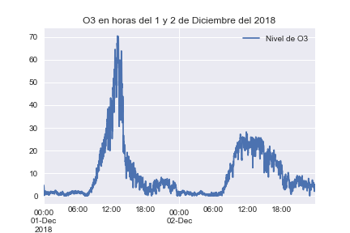
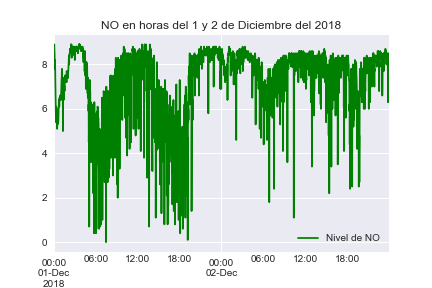
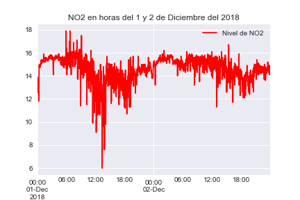
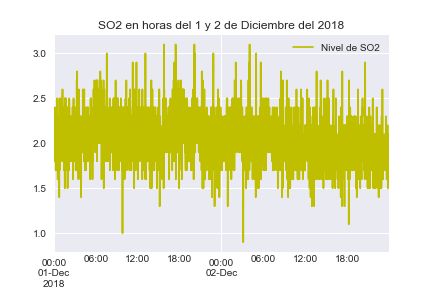
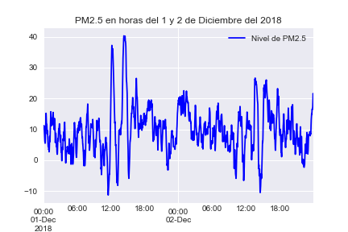
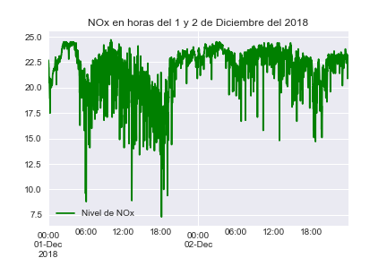
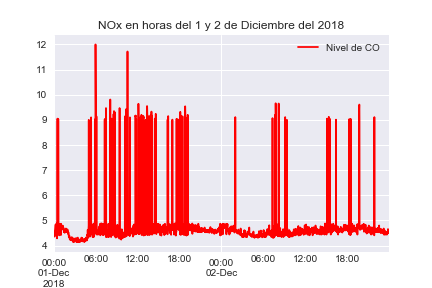

Pequeña exploración de datos de 2 dias de la calidad del aire en Culiacán


### Importamos las librerias necesitaremos


```python
import pandas as pd
```


```python
import seaborn as sns
```


```python
import matplotlib.pyplot as plt
```

### Leemos el excel, ignorando las 2 primeras filas ya que no nos interesan, y luego le quitamos todas las filas vacias que tiene


```python
data = pd.read_excel('data.csv',skiprows=2)
```


```python
data.dropna(inplace=True)
```

### Primer vistazo a los datos


```python
data.head()
```


<div>

<table border="1" class="dataframe">
  <thead>
    <tr style="text-align: right;">
      <th></th>
      <th>Date&amp;Time</th>
      <th>O3</th>
      <th>NO</th>
      <th>NO2</th>
      <th>NOx</th>
      <th>CO</th>
      <th>SO2</th>
      <th>PM2.5</th>
    </tr>
  </thead>
  <tbody>
    <tr>
      <th>1</th>
      <td>2018-12-01 00:00:00</td>
      <td>4.7</td>
      <td>8.8</td>
      <td>13.9</td>
      <td>22.7</td>
      <td>4.4</td>
      <td>1.8</td>
      <td>10.1</td>
    </tr>
    <tr>
      <th>2</th>
      <td>2018-12-01 00:01:00</td>
      <td>4.4</td>
      <td>8.8</td>
      <td>13.8</td>
      <td>22.6</td>
      <td>4.41</td>
      <td>2</td>
      <td>10.4</td>
    </tr>
    <tr>
      <th>3</th>
      <td>2018-12-01 00:02:00</td>
      <td>4</td>
      <td>8.9</td>
      <td>13.6</td>
      <td>22.5</td>
      <td>4.4</td>
      <td>2.1</td>
      <td>10.9</td>
    </tr>
    <tr>
      <th>4</th>
      <td>2018-12-01 00:03:00</td>
      <td>3.4</td>
      <td>8.7</td>
      <td>13.6</td>
      <td>22.3</td>
      <td>4.38</td>
      <td>1.8</td>
      <td>11.1</td>
    </tr>
    <tr>
      <th>5</th>
      <td>2018-12-01 00:04:00</td>
      <td>2.3</td>
      <td>8.6</td>
      <td>13.3</td>
      <td>21.9</td>
      <td>4.36</td>
      <td>1.9</td>
      <td>11.2</td>
    </tr>
  </tbody>
</table>
</div>


### Promedio de Oxido nitroso en esos 2 dias


```python
data['NO2'].mean()
```


    14.611562499999966


### Convirtiendo el campo de fecha a un campo de Fecha Real


```python
data['Date'] = pd.to_datetime(data['Date&Time'])
```

### Nos aseguramos que el nuevo campo Date haya sido creado


```python
data.head()
```


<div>

<table border="1" class="dataframe">
  <thead>
    <tr style="text-align: right;">
      <th></th>
      <th>Date&amp;Time</th>
      <th>O3</th>
      <th>NO</th>
      <th>NO2</th>
      <th>NOx</th>
      <th>CO</th>
      <th>SO2</th>
      <th>PM2.5</th>
      <th>Date</th>
    </tr>
  </thead>
  <tbody>
    <tr>
      <th>1</th>
      <td>2018-12-01 00:00:00</td>
      <td>4.7</td>
      <td>8.8</td>
      <td>13.9</td>
      <td>22.7</td>
      <td>4.4</td>
      <td>1.8</td>
      <td>10.1</td>
      <td>2018-12-01 00:00:00</td>
    </tr>
    <tr>
      <th>2</th>
      <td>2018-12-01 00:01:00</td>
      <td>4.4</td>
      <td>8.8</td>
      <td>13.8</td>
      <td>22.6</td>
      <td>4.41</td>
      <td>2</td>
      <td>10.4</td>
      <td>2018-12-01 00:01:00</td>
    </tr>
    <tr>
      <th>3</th>
      <td>2018-12-01 00:02:00</td>
      <td>4</td>
      <td>8.9</td>
      <td>13.6</td>
      <td>22.5</td>
      <td>4.4</td>
      <td>2.1</td>
      <td>10.9</td>
      <td>2018-12-01 00:02:00</td>
    </tr>
    <tr>
      <th>4</th>
      <td>2018-12-01 00:03:00</td>
      <td>3.4</td>
      <td>8.7</td>
      <td>13.6</td>
      <td>22.3</td>
      <td>4.38</td>
      <td>1.8</td>
      <td>11.1</td>
      <td>2018-12-01 00:03:00</td>
    </tr>
    <tr>
      <th>5</th>
      <td>2018-12-01 00:04:00</td>
      <td>2.3</td>
      <td>8.6</td>
      <td>13.3</td>
      <td>21.9</td>
      <td>4.36</td>
      <td>1.9</td>
      <td>11.2</td>
      <td>2018-12-01 00:04:00</td>
    </tr>
  </tbody>
</table>
</div>


```python
%matplotlib inline
```

### Creamos un indice con el campo fecha para poder trabajar en graficas con ellas.


```python
index = pd.DatetimeIndex(data['Date'])
```

### Empezamos a graficar, se hace una Serie con el campo que queremos y el indice, se crea el plot y se guarda en disco


```python
dataO3 = pd.Series(data['O3'].values, index=index)
plot = dataO3.plot(kind='line',title='O3 en horas del 1 y 2 de Diciembre del 2018',legend=True, label='Nivel de O3')
figure = plot.get_figure()
figure.savefig("O3.png")
```





```python
dataNO = pd.Series(data['NO'].values, index=index)
plot = dataNO.plot(kind='line',title='NO en horas del 1 y 2 de Diciembre del 2018',legend=True,color='g', label='Nivel de NO')
figure = plot.get_figure()
figure.savefig("NO.png")
```





```python
dataNO2 = pd.Series(data['NO2'].values, index=index)
plot = dataNO2.plot(kind='line',title='NO2 en horas del 1 y 2 de Diciembre del 2018',legend=True,color='r', label='Nivel de NO2')
figure = plot.get_figure()
figure.savefig("NO2.png")
```





```python
dataSO2 = pd.Series(data['SO2'].values, index=index)
plot = dataSO2.plot(kind='line',title='SO2 en horas del 1 y 2 de Diciembre del 2018',color='y',legend=True, label='Nivel de SO2')
figure = plot.get_figure()
figure.savefig("SO2.png")
```





```python
dataPM = pd.Series(data['PM2.5'].values, index=index)
plot = dataPM.plot(kind='line',title='PM2.5 en horas del 1 y 2 de Diciembre del 2018',color='b',legend=True, label='Nivel de PM2.5')
figure = plot.get_figure()
figure.savefig("PM.png")
```





```python
dataNOx = pd.Series(data['NOx'].values, index=index)
plot = dataNOx.plot(kind='line',title='NOx en horas del 1 y 2 de Diciembre del 2018',color='g',legend=True, label='Nivel de NOx')
figure = plot.get_figure()
figure.savefig("NOx.png")
```





```python
def to_number(n):
    if(isinstance(n, float) or isinstance(n,int)):
        return n
    else:
        return float(n.replace(' ',''))
    
```

### El campo de "CO", tiene algunos numeros mal, por lo que reemplazamos espacios vacios para poder convertirlos a numeros


```python
data['CO'] = data['CO'].map(to_number)
```


```python
dataCO = pd.Series(data['CO'].values, index=index)
pd.to_numeric(dataCO, errors='coerce')
plot = dataCO.plot(kind='line',title='NOx en horas del 1 y 2 de Diciembre del 2018',color='r',legend=True, label='Nivel de CO')
figure = plot.get_figure()
figure.savefig("CO.png")
```




